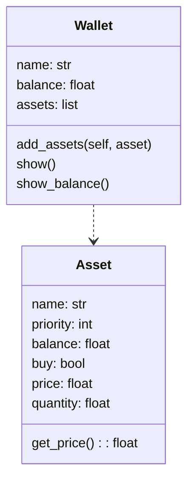

# Kotizoj Classes

```mermaid
classDiagram
    class Wallet{
        name: str
        balance: float
        assets: list
        add_assets(self, asset)
        show()
        show_balance()
    }

    class Asset{
        name: str
        priority: int
        balance: float
        buy: bool
        price: float
        quantity: float
        get_price(): float
    }

    Wallet ..> Asset
```