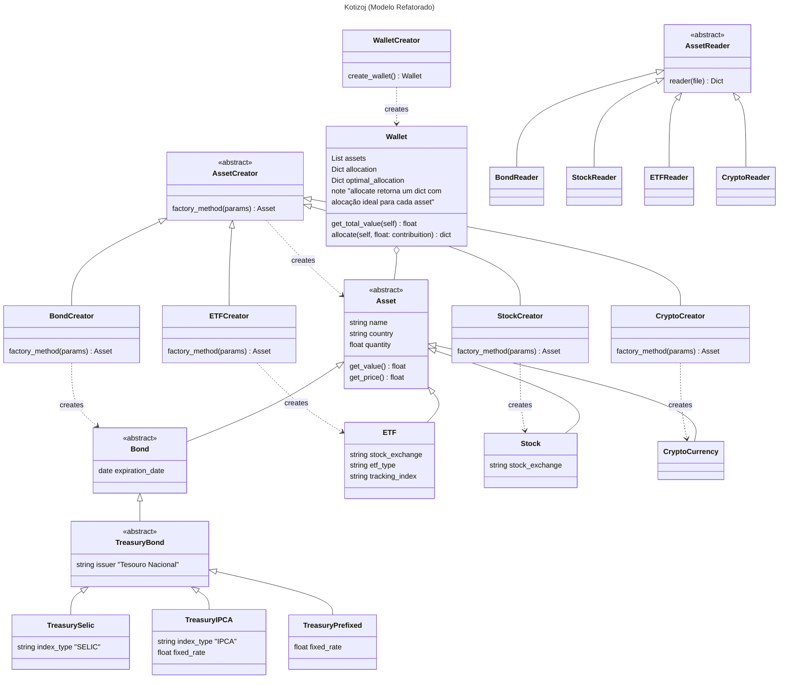

# TODO
- [] Linkar readers para os creators
- [] 

```mermaid
---
title: Kotizoj (Modelo Refatorado)
---
classDiagram
    WalletCreator ..> Wallet : creates
    AssetCreator ..> Asset : creates
    BondCreator ..> Bond : creates
    ETFCreator ..> ETF : creates
    StockCreator ..> Stock : creates
    CryptoCreator ..> CryptoCurrency : creates
    class AssetReader {
        <<abstract>>
        reader(file) Dict<String:Float>
    }
    AssetReader <|-- BondReader
    class BondReader {
    }
    AssetReader <|-- StockReader
    class StockReader {
    }
    AssetReader <|-- ETFReader
    class ETFReader {
    }
    AssetReader <|-- CryptoReader
    class CryptoReader {
    }
    class WalletCreator {
        create_wallet() Wallet
    }
    class Wallet {
        List<Asset> assets
        Dict<String, float> allocation
        Dict<String, float> optimal_allocation
        get_total_value(self) float
        allocate(self, float: contribuition) dict
        note "allocate retorna um dict com 
            alocação ideal para cada asset"
    }
    Wallet o-- Asset

    class AssetCreator {
        <<abstract>>
        factory_method(params) Asset
    }
    AssetCreator <|-- BondCreator
    AssetCreator <|-- StockCreator
    AssetCreator <|-- ETFCreator
    AssetCreator <|-- CryptoCreator
    class BondCreator {
        factory_method(params) Asset
    }
    class StockCreator {
        factory_method(params) Asset
    }

    class ETFCreator {
        factory_method(params) Asset
    }

    class CryptoCreator {
        factory_method(params) Asset
    }

    class Asset {
        <<abstract>>
        string name
        string country
        float quantity
        get_value() float
        get_price() float
    }

    Asset <|-- Bond
    class Bond {
        <<abstract>>
        date expiration_date
    }

    Bond <|-- TreasuryBond
    class TreasuryBond {
        <<abstract>>
        string issuer "Tesouro Nacional"
    }

    TreasuryBond <|-- TreasurySelic
    TreasuryBond <|-- TreasuryIPCA
    TreasuryBond <|-- TreasuryPrefixed
    class TreasurySelic {
        string index_type "SELIC"
    }
    class TreasuryIPCA {
        string index_type "IPCA"
        float fixed_rate
    }
    class TreasuryPrefixed {
        float fixed_rate
    }

    Asset <|-- Stock
    class Stock {
        string stock_exchange
    }

    Asset <|-- ETF
    class ETF {
        string stock_exchange
        string etf_type
        string tracking_index
    }

    Asset <|-- CryptoCurrency
    class CryptoCurrency {
    }
```

